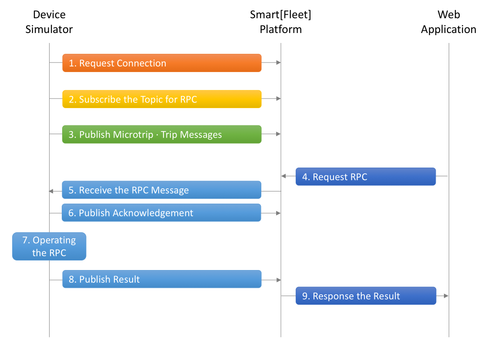

# Smart[Fleet] Device Simulator

본 시뮬레이터는 SKT의 Smart[Fleet] 플랫폼 프로토콜을 따르는 ``GPS``, ``OBD`` 단말의 동작을 나타내는 시뮬레이터입니다.

본 시뮬레이터는 Smart[Fleet] 플랫폼의 [기술문서](http://smart-fleet-docs.readthedocs.io/ko/latest/)를 기반으로 구성되어 있습니다. 상세한 프로토콜은 상기 기술문서를 참고하세요.

## Smart[Fleet] Device Simulator Flow

본 시뮬레이터는 아래의 Flow를 기반으로 작성되어 있으며, 아래의 Flow는 [단말 프로시저 규격](http://smart-fleet-docs.readthedocs.io/ko/latest/procedure/)와 [단말 전송 메시지 규격](http://smart-fleet-docs.readthedocs.io/ko/latest/message/)을 참고 바랍니다.



하기 제공되는 각 단말 시뮬레이터의 코드에는 상기 Flow의 순서가 주석으로 표기되어 있으니, 각 순서를 코드와 매핑하여 이해하시면 됩니다.

```
/////////////////////////////////////////////////////////////////
// Create MQTT Async Client
/////////////////////////////////////////////////////////////////

MQTTAsync_create(&client, ADDRESS, CLIENTID, MQTTCLIENT_PERSISTENCE_NONE, NULL);

MQTTAsync_setCallbacks(client, client, connlost, msgarrvd, NULL);

conn_opts.keepAliveInterval = 20;
conn_opts.cleansession = 1;
conn_opts.onSuccess = onConnect;
conn_opts.onFailure = onConnectFailure;
conn_opts.context = client;
conn_opts.username = USERNAME;

ssl_opts.enableServerCertAuth = 1;
conn_opts.ssl = &ssl_opts;

/////////////////////////////////////////////////////////////////
// Request Connection
/////////////////////////////////////////////////////////////////
if ((rc = MQTTAsync_connect(client, &conn_opts)) != MQTTASYNC_SUCCESS)
{
    printf("Failed to start connect, return code %d\n", rc);
    exit(EXIT_FAILURE);
}
```

### Device Simulator 구성

본 시뮬레이터는 ``C programming language``로 작성되었습니다. 비동기(Asynchronous)적으로 동작하며, 기술 규격에 따라 ``MQTT``프로토콜에 준수하여 개발이 되어 있습니다.

본 시뮬레이터에서 제공하는 단말 타입은 ``GPS``, ``OBD``이며 아래의 파일에 시뮬레이션 과정이 코딩되어 있습니다.

* smartfleet_client_simulator.c

### Device Simulator 실행 방법

본 시뮬레이터를 동작을 위해서는 빌드하는 과정이 필요합니다. 따라서 ``gcc``가 설치되어 있어야 합니다. 또한 ``MQTT`` 프로토콜을 구현한 라이브러리인 [Elipse Paho](https://www.eclipse.org/paho/)를 먼저 빌드해야 합니다.

_Eclipse Paho_ 를 빌드하는 방법은 [Elipse Paho - MQTT C Client for Posix and Windows](https://www.eclipse.org/paho/clients/c/)를 참고하십시오.

_Eclipse Paho_ 빌드 후 다음과 같이 device-simulator-c 예제를 빌드할 수 있습니다.(참고: 본 예제는 SSL/TLS를 적용하여 구현하였기 때문에 SSL을 사용하는 ``libpaho-mqttas.so``를 링크하여 빌드합니다.)

```
git clone https://github.com/skt-smartfleet/device-simulator-c.git
cd device-simulator-c
gcc smartfleet_client_simulator.c -lpaho-mqttas -o device-simulator
```

빌드 후 ``device-simulator``라는 실행파일이 생성됩니다. 이 파일을 실행하며 본 시뮬레이터를 실행할 수 있습니다.

```
./device-simulator
```

본 저장소에는 미리 빌드된 _Eclipse Paho_ 라이브러리가 ``lib`` 디렉터리에 제공되고 있습니다. 이 라이브러리를 사용하여 빌드할 경우 다음과 같이 실행해야 합니다.

```
gcc smartfleet_client_simulator.c -lpaho-mqttas -Llib -o device-simulator
```

미리 빌드된 라이브러리는 CentOS 7 에서 빌드되었으며 다른 OS에서는 동작하지 않을 수 있습니다.

### Device Simulator 설정 방법

본 시뮬레이터 동작을 위한 설정은 예제 소스 코드(``smartfleet_client_simulator.c``)를 참고하십시오.

아래 코드의 내용 중에서 수정이 필요한 사항은 다음과 같습니다.

Key                 |  Description                            |
--------------------|-----------------------------------------|
USERNAME            | MQTT Conection에 명시하는 ``username`` 항목으로 해당 항목에는 Smart[Fleet]에 정상적으로 등록된 단말임을 증명하는 ``AccessToken``값을 기입해야합니다. 시뮬레이션을 위한 20자리의 Token 값을 발급 받기위해서는 Repository Issue([Link](https://github.com/skt-smartfleet/device-simulator/issues))에 이슈 등록 부탁 드립니다.

```
#define ADDRESS                     "ssl://smartfleet.sktelecom.com:9900"
#define CLIENTID                    "ExampleClientPub"
#define RPC_REQ_TOPIC               "v1/sensors/me/rpc/request/+"
#define SENDING_TOPIC               "v1/sensors/me/tre"
#define USERNAME                    "A123456789123456789D"
```

### Device Simulator 정상 동작 예시

정상적으로 설정된 Device Simulator의 동작 예시입니다.

```
Successful connection to Smart[Fleet] Platform
Press Q<Enter> to quit

Subscribing to topic v1/sensors/me/rpc/request/+

Sending a Microtrip Message to Smart[Fleet] {"ty":2,"ts":9999999999999,"pld":{"tid":1000,"lon":127.999999,"lat":37.510296,"alt":106,"sp":75,"dop":14,"nos":6,"clt":1507970678509}} on topic v1/sensors/me/tre

Sending a Trip Message to Smart[Fleet] {"ty":1,"ts":9999999999999,"pld":{"tid":1000,"stt":1511174279847,"edt":1511174337972,"dis":2559,"tdis":1023123,"fc":57355568,"stlat":37.509141,"stlon":127.063228,"edlat":37.520683,"edlon":127.06396,"ctp":100,"coe":1231,"fct":1923,"hsts":97,"mesp":43,"idt":440,"btv":9.3,"gnv":14.6,"wut":300,"dtvt":100}} on topic v1/sensors/me/tre

Message with token value 0 delivery confirmed
Subscribe succeeded
Message with token value 2 delivery confirmed
Successful disconnection
```
